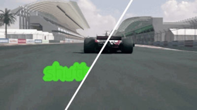
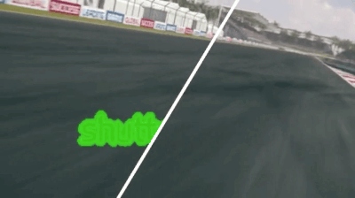

<div align="center">

<div class="logo">
   <a href="https://shangchenzhou.com/projects/ProPainter/">
      
   </a>
</div>

<h1>ProPainter: Improving Propagation and Transformer for Video Inpainting</h1>

<div>
    <a href='https://shangchenzhou.com/' target='_blank'>Shangchen Zhou</a>&emsp;
    <a href='https://li-chongyi.github.io/' target='_blank'>Chongyi Li</a>&emsp;
    <a href='https://ckkelvinchan.github.io/' target='_blank'>Kelvin C.K. Chan</a>&emsp;
    <a href='https://www.mmlab-ntu.com/person/ccloy/' target='_blank'>Chen Change Loy</a>
</div>
<div>
    S-Lab, Nanyang Technological University&emsp; 
</div>

<div>
    <strong>ICCV 2023</strong>
</div>
<div>
    <h4 align="center">
        <a href="https://shangchenzhou.com/projects/ProPainter/" target='_blank'>[Project Page]</a> •
        <a href="#" target='_blank'>[arXiv (coming soon)]</a> •
        <a href="https://youtu.be/Cc89WF-2zz0" target='_blank'>[Demo Video]</a>
    </h4>
</div>

:open_book: For more visual results, go checkout our <a href="https://shangchenzhou.com/projects/ProPainter/" target="_blank">project page</a>


---

</div>


## Update

<!-- - **2023.09.02**: Our code and model are publicly available. :whale:  -->
- **2023.09.01**: This repo is created.

## Results

#### 🏂 Object Removal
<table>
<tr>
   <td> 
      
   </td>
   <td> 
      
   </td>
</tr>
</table>

#### 🌈 Watermark Removal
<table>
<tr>
   <td> 
      
   </td>
   <td> 
      
   </td>
</tr>
</table>

#### 🎨 Video Completion
<table>
<tr>
   <td> 
      
   </td>
   <td> 
      
   </td>
</tr>
</table>


## Overview


## Citation

   If you find our repo useful for your research, please consider citing our paper:

   ```bibtex
   @inproceedings{zhou2023propainter,
      title={{ProPainter}: Improving Propagation and Transformer for Video Inpainting},
      author={Zhou, Shangchen and Li, Chongyi and Chan, Kelvin C.K and Loy, Chen Change},
      booktitle={Proceedings of IEEE International Conference on Computer Vision (ICCV)},
      year={2023}
   }
   ```


## License

This project is licensed under <a rel="license" href="./LICENSE">NTU S-Lab License 1.0</a>. Redistribution and use should follow this license.


## Contact
If you have any questions, please feel free to reach me out at `shangchenzhou@gmail.com`. 

## Acknowledgement

This code is based on [E2FGVI](https://github.com/MCG-NKU/E2FGVI) and [STTN](https://github.com/researchmm/STTN). Some code are brought from [BasicVSR++](https://github.com/ckkelvinchan/BasicVSR_PlusPlus). Thanks for their awesome works.