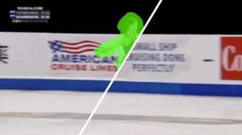
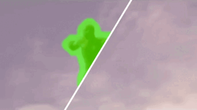
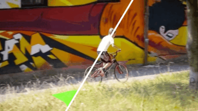
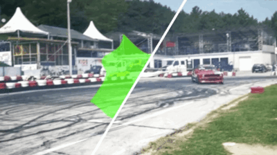
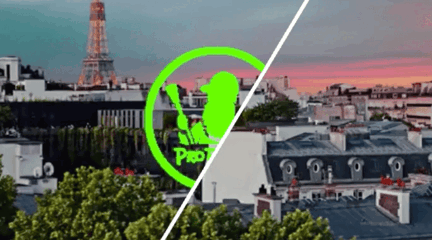
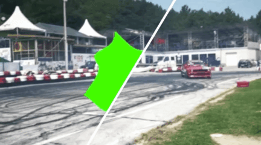
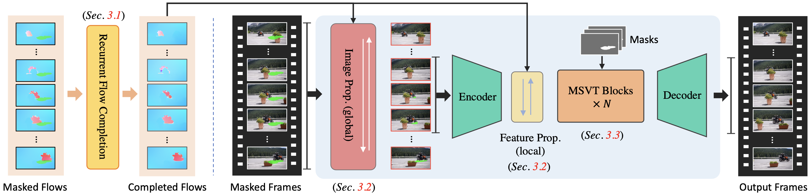

<div align="center">

<div class="logo">
   <a href="https://shangchenzhou.com/projects/ProPainter/">
      
   </a>
</div>

<h1>ProPainter: Improving Propagation and Transformer for Video Inpainting</h1>

<div>
    <a href='https://shangchenzhou.com/' target='_blank'>Shangchen Zhou</a>&emsp;
    <a href='https://li-chongyi.github.io/' target='_blank'>Chongyi Li</a>&emsp;
    <a href='https://ckkelvinchan.github.io/' target='_blank'>Kelvin C.K. Chan</a>&emsp;
    <a href='https://www.mmlab-ntu.com/person/ccloy/' target='_blank'>Chen Change Loy</a>
</div>
<div>
    S-Lab, Nanyang Technological University&emsp; 
</div>

<div>
    <strong>ICCV 2023</strong>
</div>

<div>
    <h4 align="center">
        <a href="https://shangchenzhou.com/projects/ProPainter" target='_blank'>
        
        </a>
        <a href="https://arxiv.org/abs/2309.03897" target='_blank'>
        
        </a>
        <a href="https://youtu.be/92EHfgCO5-Q" target='_blank'>
        
        </a>
        <a href="https://huggingface.co/spaces/sczhou/ProPainter" target='_blank'>
        
        </a>
        <a href="https://openxlab.org.cn/apps/detail/ShangchenZhou/ProPainter" target='_blank'>
        
        </a>
        
    </h4>
</div>

⭐ If ProPainter is helpful to your projects, please help star this repo. Thanks! 🤗

:open_book: For more visual results, go checkout our <a href="https://shangchenzhou.com/projects/ProPainter/" target="_blank">project page</a>


---

</div>


## Update
- **2023.11.09**: Integrated to :man_artist: [OpenXLab](https://openxlab.org.cn/apps). Try out online demo! [](https://openxlab.org.cn/apps/detail/ShangchenZhou/ProPainter)
- **2023.11.09**: Integrated to :hugs: [Hugging Face](https://huggingface.co/spaces). Try out online demo! [](https://huggingface.co/spaces/sczhou/ProPainter)
- **2023.09.24**: We remove the watermark removal demos officially to prevent the misuse of our work for unethical purposes.
- **2023.09.21**: Add features for memory-efficient inference. Check our [GPU memory](https://github.com/sczhou/ProPainter#-memory-efficient-inference) requirements. 🚀
- **2023.09.07**: Our code and model are publicly available. 🐳
- **2023.09.01**: This repo is created.


### TODO
- [ ] Make a Colab demo.
- [x] ~~Make a interactive Gradio demo.~~
- [x] ~~Update features for memory-efficient inference.~~
  
## Results

#### 👨🏻‍🎨 Object Removal
<table>
<tr>
   <td> 
      
   </td>
   <td> 
      
   </td>
</tr>
</table>

#### 🎨 Video Completion
<table>
<tr>
   <td> 
      
   </td>
   <td> 
      
   </td>
</tr>
<tr>
   <td> 
      
   </td>
   <td> 
      
   </td>
</tr>
</table>


## Overview



## Dependencies and Installation

1. Clone Repo

   ```bash
   git clone https://github.com/sczhou/ProPainter.git
   ```

2. Create Conda Environment and Install Dependencies

   ```bash
   # create new anaconda env
   conda create -n propainter python=3.8 -y
   conda activate propainter

   # install python dependencies
   pip3 install -r requirements.txt
   ```

   - CUDA >= 9.2
   - PyTorch >= 1.7.1
   - Torchvision >= 0.8.2
   - Other required packages in `requirements.txt`

## Get Started
### Prepare pretrained models
Download our pretrained models from [Releases V0.1.0](https://github.com/sczhou/ProPainter/releases/tag/v0.1.0) to the `weights` folder. (All pretrained models can also be automatically downloaded during the first inference.)

The directory structure will be arranged as:
```
weights
   |- ProPainter.pth
   |- recurrent_flow_completion.pth
   |- raft-things.pth
   |- i3d_rgb_imagenet.pt (for evaluating VFID metric)
   |- README.md
```

### 🏂 Quick test
We provide some examples in the [`inputs`](./inputs) folder. 
Run the following commands to try it out:
```shell
# The first example (object removal)
python inference_propainter.py --video inputs/object_removal/bmx-trees --mask inputs/object_removal/bmx-trees_mask 
# The second example (video completion)
python inference_propainter.py --video inputs/video_completion/running_car.mp4 --mask inputs/video_completion/mask_square.png --height 240 --width 432
```

The results will be saved in the `results` folder.
To test your own videos, please prepare the input `mp4 video` (or `split frames`) and `frame-wise mask(s)`.

If you want to specify the video resolution for processing or avoid running out of memory, you can set the video size of `--width` and `--height`:
```shell
# process a 576x320 video; set --fp16 to use fp16 (half precision) during inference.
python inference_propainter.py --video inputs/video_completion/running_car.mp4 --mask inputs/video_completion/mask_square.png --height 320 --width 576 --fp16
```

### 🚀 Memory-efficient inference

Video inpainting typically requires a significant amount of GPU memory. Here, we offer various features that facilitate memory-efficient inference, effectively avoiding the Out-Of-Memory (OOM) error. You can use the following options to reduce memory usage further:

   - Reduce the number of local neighbors through decreasing the `--neighbor_length` (default 10).
   - Reduce the number of global references by increasing the `--ref_stride` (default 10).
   - Set the `--resize_ratio` (default 1.0) to resize the processing video.
   - Set a smaller video size via specifying the `--width` and `--height`.
   - Set `--fp16` to use fp16 (half precision) during inference.
   - Reduce the frames of sub-videos `--subvideo_length` (default 80), which effectively decouples GPU memory costs and video length.

Blow shows the estimated GPU memory requirements for different sub-video lengths with fp32/fp16 precision: 

| Resolution | 50 frames | 80 frames |
| :---       | :----:    | :----:    |
| 1280 x 720 | 28G / 19G | OOM / 25G |
| 720 x 480  | 11G / 7G  | 13G / 8G  |
| 640 x 480  | 10G / 6G  | 12G / 7G  |
| 320 x 240  | 3G  / 2G  | 4G  / 3G  | 


## Dataset preparation
<table>
<thead>
  <tr>
    <th>Dataset</th>
    <th>YouTube-VOS</th>
    <th>DAVIS</th>
  </tr>
</thead>
<tbody>
  <tr>
    <td>Description</td>
    <td>For training (3,471) and evaluation (508)</td>
    <td>For evaluation (50 in 90)</td>
  <tr>
    <td>Images</td>
    <td> [<a href="https://competitions.codalab.org/competitions/19544#participate-get-data">Official Link</a>] (Download train and test all frames) </td>
    <td> [<a href="https://data.vision.ee.ethz.ch/csergi/share/davis/DAVIS-2017-trainval-480p.zip">Official Link</a>] (2017, 480p, TrainVal) </td>
  </tr>
  <tr>
    <td>Masks</td>
    <td colspan="2"> [<a href="https://drive.google.com/file/d/1dFTneS_zaJAHjglxU10gYzr1-xALgHa4/view?usp=sharing">Google Drive</a>] [<a href="https://pan.baidu.com/s/1JC-UKmlQfjhVtD81196cxA?pwd=87e3">Baidu Disk</a>] (For reproducing paper results; provided in <a href="https://arxiv.org/abs/2309.03897">ProPainter</a> paper) </td>
  </tr>
</tbody>
</table>

The training and test split files are provided in `datasets/<dataset_name>`. For each dataset, you should place `JPEGImages` to `datasets/<dataset_name>`. Resize all video frames to size `432x240` for training. Unzip downloaded mask files to `datasets`.

The `datasets` directory structure will be arranged as: (**Note**: please check it carefully)
```
datasets
   |- davis
      |- JPEGImages_432_240
         |- <video_name>
            |- 00000.jpg
            |- 00001.jpg
      |- test_masks
         |- <video_name>
            |- 00000.png
            |- 00001.png   
      |- train.json
      |- test.json
   |- youtube-vos
      |- JPEGImages_432_240
         |- <video_name>
            |- 00000.jpg
            |- 00001.jpg
      |- test_masks
         |- <video_name>
            |- 00000.png
            |- 00001.png
      |- train.json
      |- test.json   
```

## Training
Our training configures are provided in [`train_flowcomp.json`](./configs/train_flowcomp.json) (for Recurrent Flow Completion Network) and [`train_propainter.json`](./configs/train_propainter.json) (for ProPainter).

Run one of the following commands for training:
```shell
 # For training Recurrent Flow Completion Network
 python train.py -c configs/train_flowcomp.json
 # For training ProPainter
 python train.py -c configs/train_propainter.json
```
You can run the **same command** to **resume** your training.

To speed up the training process, you can precompute optical flow for the training dataset using the following command:
```shell
 # Compute optical flow for training dataset
 python scripts/compute_flow.py --root_path <dataset_root> --save_path <save_flow_root> --height 240 --width 432
```

## Evaluation
Run one of the following commands for evaluation:
```shell
 # For evaluating flow completion model
 python scripts/evaluate_flow_completion.py --dataset <dataset_name> --video_root <video_root> --mask_root <mask_root> --save_results
 # For evaluating ProPainter model
 python scripts/evaluate_propainter.py --dataset <dataset_name> --video_root <video_root> --mask_root <mask_root> --save_results
```

The scores and results will also be saved in the `results_eval` folder.
Please `--save_results` for further [evaluating temporal warping error](https://github.com/phoenix104104/fast_blind_video_consistency#evaluation).


## Citation

   If you find our repo useful for your research, please consider citing our paper:

   ```bibtex
   @inproceedings{zhou2023propainter,
      title={{ProPainter}: Improving Propagation and Transformer for Video Inpainting},
      author={Zhou, Shangchen and Li, Chongyi and Chan, Kelvin C.K and Loy, Chen Change},
      booktitle={Proceedings of IEEE International Conference on Computer Vision (ICCV)},
      year={2023}
   }
   ```


## License

#### Non-Commercial Use Only Declaration
The ProPainter is made available for use, reproduction, and distribution strictly for non-commercial purposes. The code and models are licensed under <a rel="license" href="./LICENSE">NTU S-Lab License 1.0</a>. Redistribution and use should follow this license.

For inquiries or to obtain permission for commercial use, please consult Dr. Shangchen Zhou (shangchenzhou@gmail.com).


## Projects that use ProPainter

If you develop or use ProPainter in your projects, feel free to let me know. Also, please include this [ProPainter](https://github.com/sczhou/ProPainter) repo link, authorship information, and our [S-Lab license](https://github.com/sczhou/ProPainter/blob/main/LICENSE) (with link).

#### Projects/Applications from the Community

- Streaming ProPainter: https://github.com/osmr/propainter
- Faster ProPainter: https://github.com/halfzm/faster-propainter
- ProPainter WebUI: https://github.com/halfzm/ProPainter-Webui
- ProPainter ComfyUI: https://github.com/daniabib/ComfyUI_ProPainter_Nodes
- Cutie (video segmentation): https://github.com/hkchengrex/Cutie
- Cinetransfer (character transfer): https://virtualfilmstudio.github.io/projects/cinetransfer
- Motionshop (character transfer): https://aigc3d.github.io/motionshop


#### PyPI
- propainter: https://pypi.org/project/propainter
- pytorchcv: https://pypi.org/project/pytorchcv

## Contact
If you have any questions, please feel free to reach me out at shangchenzhou@gmail.com. 

## Acknowledgement

This code is based on [E<sup>2</sup>FGVI](https://github.com/MCG-NKU/E2FGVI) and [STTN](https://github.com/researchmm/STTN). Some code are brought from [BasicVSR++](https://github.com/ckkelvinchan/BasicVSR_PlusPlus). Thanks for their awesome works. 

Special thanks to [Yihang Luo](https://github.com/Luo-Yihang) for his valuable contributions to build and maintain the Gradio demos for ProPainter.
